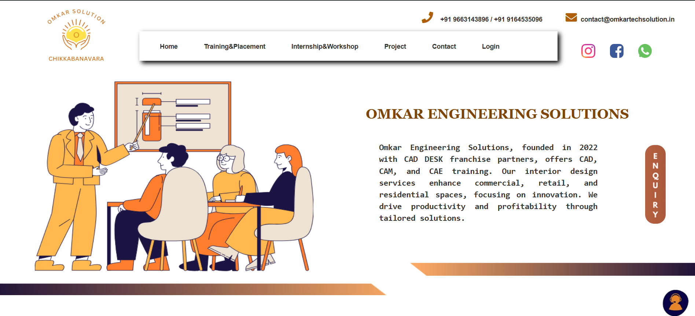

## Note
This site is not live anymore, but the repository remains as part of my portfolio.
This was developed during my time at a startup for real clients.  
Although the site is not deployed live anymore, this repository showcases the code, design, and development work I contributed.

# Omkar Tech Solutions
Corporate website for an engineering and design training company offering CAD/CAM/CAE solutions and interior design services with innovation-driven focus.

## Tech Stack
- HTML
- CSS
- JavaScript
- Firebase
- Canva

## Features
- Responsive design
- User-friendly layout
- Interactive elements

## Project Context
Built as part of client projects at K-AKA Technology Services, focusing on delivering practical and visually appealing websites.

## Homepage Screenshots

